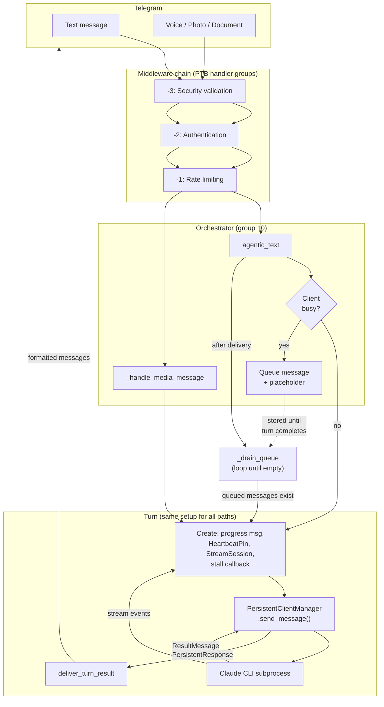
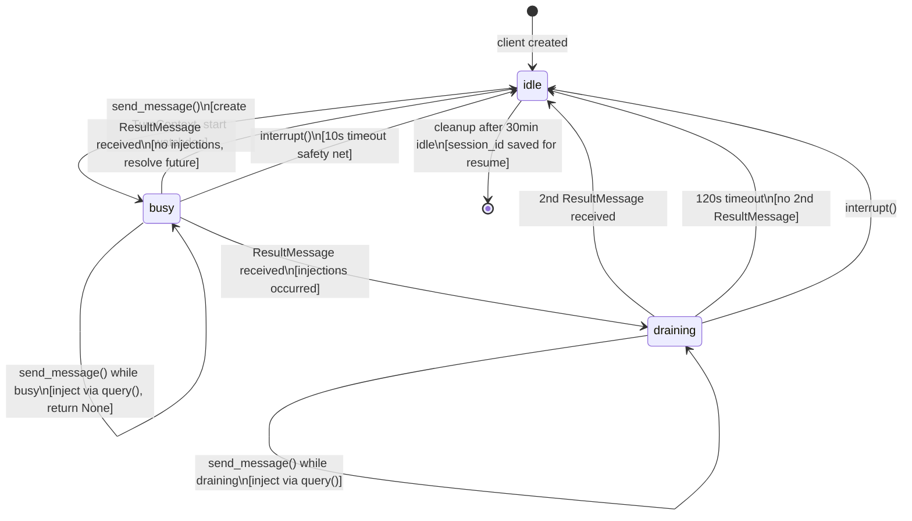
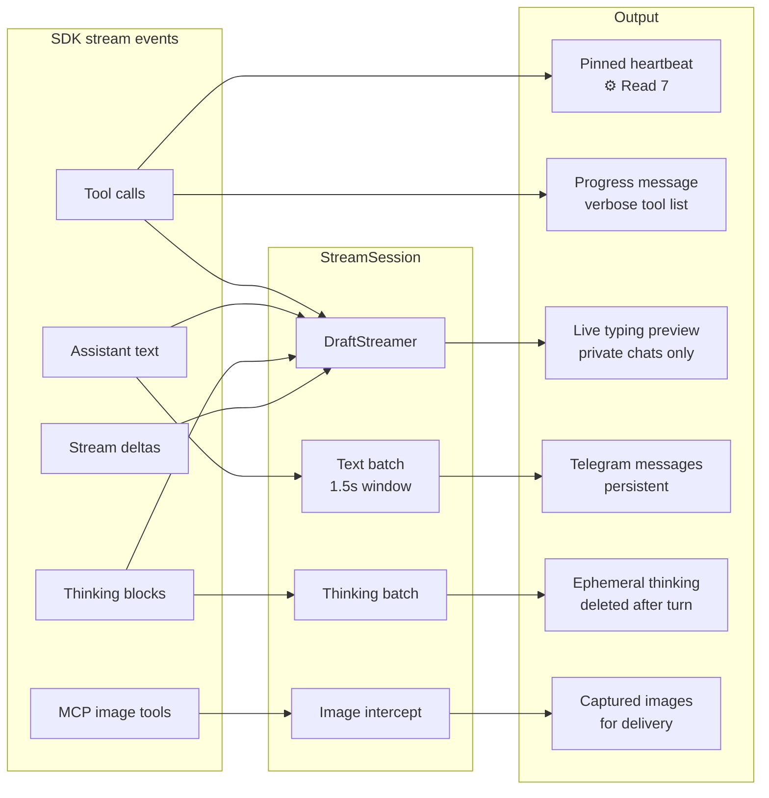
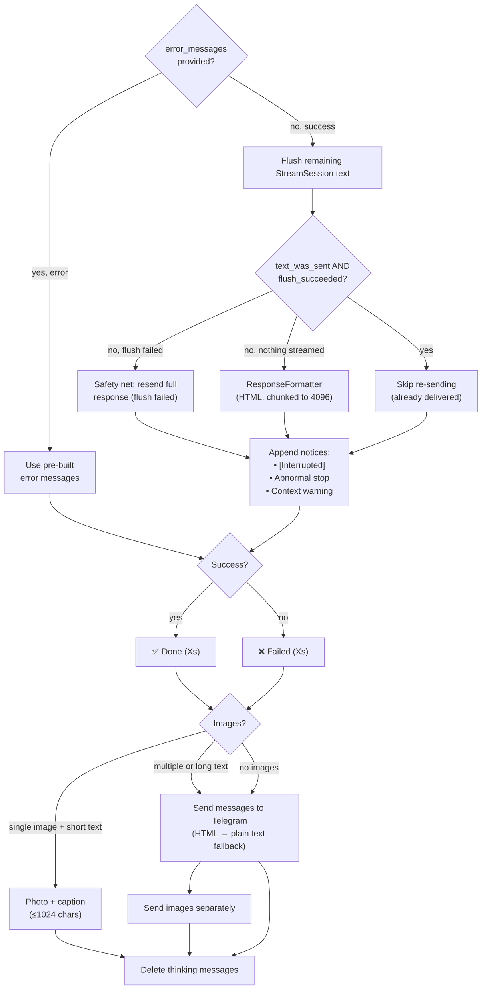

# Architecture

How the bot works, end to end. Read this to understand what happens when a message arrives, how Claude processes it, and how the response gets back to Telegram.

## What it is

A personal Telegram bot bridging phone-based interaction to Claude Code running on a Mac Mini. One user, one bot. Built for executive dysfunction mitigation — brain dumps, tasks, reminders — not developer tooling or multi-tenant platforms.

## Request flow — the three paths

Every message passes through the same middleware chain, then hits the orchestrator. The orchestrator decides: send to Claude immediately, queue it, or process media first. All paths converge on the same delivery pipeline.

### Direct text (`agentic_text`)

The normal path. User sends a message, it passes through middleware, the orchestrator checks if the Claude client is busy. If idle, it runs a full turn. If busy, the message is queued with a placeholder ("Queued (N ahead)").

### Queue drain (`_drain_queue`)

Called at the end of `agentic_text` after the turn completes. Queued messages do NOT re-enter middleware — they were already authenticated on arrival. The drain loop: pop the queue, delete placeholders, combine messages with timestamps, send the combined text as a new turn. If more messages arrive during the drain turn, they get queued and drained on the next iteration.

### Media (`_handle_media_message`)

Voice notes are transcribed (Parakeet MLX locally, or Mistral/OpenAI APIs). Photos are base64-encoded for multimodal input. Documents are processed. The result is text or text+images sent to Claude via `send_message`.

**Known gap:** media handlers do NOT check if the client is busy. If the user sends a voice note while Claude is working, `send_message` injects it (returns None), the progress message is silently deleted, and no response is shown. Text messages avoid this because `agentic_text` checks `get_client_state()` and queues instead.

### Turn setup

All three paths create the same objects before calling `send_message`:

| Object | Purpose | Lifecycle |
|--------|---------|-----------|
| Progress message | "Working..." edited during turn, finalised to "Done (Xs)" | Created → edited → finalised |
| HeartbeatPin | Pinned message showing "⚙️ Read 7" (if `ENABLE_HEARTBEAT_PIN`) | Created → updated per tool call (5s throttle) → edited to "Done" → unpinned → deleted. None if disabled. |
| StreamSession | Callable stream callback routing SDK events | Created → called per event → flushed → thinking cleaned up |
| Stall callback | Edits progress message on silence (30s/60s) | Created → called by watchdog → superseded by delivery |

## Persistent client state machine

One `ClaudeSDKClient` subprocess per Telegram thread, managed by `PersistentClientManager`. The subprocess stays alive between turns — this is how Claude maintains conversation context.

**Key details:**
- **Queue vs injection** — the orchestrator never injects. It checks `get_client_state()` and queues messages when the client is busy. Injection exists in `PersistentClientManager.send_message()` for callers that send while busy (the webhook/scheduler `AgentHandler` path). Injection calls `client.query()` which writes to the CLI's stdin. `send_message()` returns `None` for injections.
- **Draining** — after the first turn completes, if injections occurred, the client enters draining state waiting for the continuation `ResultMessage`. This is undocumented SDK behaviour — injection works because the CLI reads stdin continuously, but whether it produces a response is unpredictable. The 120s timeout is a guess.
- **Session resume** — when idle clients are cleaned up (30min timeout), their `session_id` is saved. On next message, the client is recreated with `continue_session=True`, preserving conversation context.
- **Response collector** — a background task (`_response_collector`) runs for the client's lifetime, reading every message from CLI stdout. It routes stream events to the `StreamSession` callback and handles `ResultMessage` to resolve turn futures.
- **Watchdog** — fires at 30s, then every 60s. Checks if the CLI subprocess is alive. Calls the stall callback to update the progress message. Diagnostic only — does not intervene.

## Stream handling

During a turn, the `StreamSession` (callable class, passed as `stream_callback`) processes every SDK event:

Tool calls fan out to three parallel outputs (not a chain): HeartbeatPin update, tool_log for verbose progress, and DraftStreamer for live preview. All three happen in the same for-loop.

**Concurrency control:**
- `_stream_lock` — protects mutable state (pending lists, batch task). Held briefly during enqueue and flush-collect.
- `_send_lock` — serialises Telegram sends so concurrent flushes don't interleave. Separate from stream_lock so network I/O never blocks enqueue.

**Progress message edits** — 8-second throttle, skipped entirely when HeartbeatPin has an active message (the pin IS the liveness signal).

**Secret redaction** — tool inputs are scanned for API keys, AWS keys, auth tokens, connection strings, and Bearer/Basic headers before display.

## Delivery pipeline

`deliver_turn_result` is the single exit point for all three turn paths.

Callers provide `error_messages` when the turn threw an exception (CancelledError for `/stop`, general exceptions for failures). When error_messages is present, the normal flush/format path is skipped entirely.

**Context warnings** — threshold-based (70%, 60%, 50%... down to 5%), deduplicated via `user_data` so the same threshold isn't warned twice.

**Abnormal stop notices** — maps `stop_reason` to user-facing labels (max_tokens → "reached token limit", etc.).

## Middleware chain

| Group | Handler | What it does |
|-------|---------|-------------|
| -3 | `security_middleware` | Blocks shell metacharacters (`;`, `&&`, `$()`), path traversal (`..`), secret file access (`.env`, `.ssh`, `.pem`). Relaxable with `DISABLE_SECURITY_PATTERNS=true`. |
| -2 | `auth_middleware` | Checks Telegram user ID against `ALLOWED_USERS` whitelist. Optional token-based auth. |
| -1 | `rate_limit_middleware` | Token bucket per user. Configurable via `RATE_LIMIT_REQUESTS`, `RATE_LIMIT_WINDOW`, `RATE_LIMIT_BURST`. |
| 10 | Orchestrator | Commands (`/start`, `/new`, `/status`, `/verbose`, `/repo`, `/model`, `/restart`, `/stop`) and `agentic_text` catch-all. |

Rejection at any middleware layer raises `ApplicationHandlerStop`, preventing subsequent groups from running.

**SDK-level tool validation** — separate from the middleware chain, `ToolMonitor` (`src/claude/monitor.py`) validates Claude's tool calls against the allowlist/disallowlist via a `can_use_tool` callback set when building SDK options. This runs inside the Claude subprocess, not in the Telegram message pipeline. Bypassable with `DISABLE_TOOL_VALIDATION=true`.

## Feature flags

| Setting | Default | Effect |
|---------|---------|--------|
| `ENABLE_HEARTBEAT_PIN` | true | Pinned liveness message during turns |
| `VERBOSE_LEVEL` | 1 | 0=quiet, 1=tool names, 2=tool names + inputs |
| `ENABLE_STREAM_DRAFTS` | false | Live typing preview via sendMessageDraft (private chats) |
| `ENABLE_MCP` | false | Model Context Protocol (requires `MCP_CONFIG_PATH`) |
| `ENABLE_VOICE_MESSAGES` | true | Voice transcription (parakeet/mistral/openai) |
| `ENABLE_PROJECT_THREADS` | false | Topic-per-project routing in Telegram forums |
| `ENABLE_API_SERVER` | false | FastAPI webhook server |
| `ENABLE_SCHEDULER` | false | APScheduler cron jobs |

## Key directories

| Directory | What lives there |
|-----------|-----------------|
| `src/bot/orchestrator.py` | Message routing, commands, agentic_text, queue management |
| `src/bot/delivery.py` | deliver_turn_result, make_stall_callback, context warnings |
| `src/bot/stream_handler.py` | StreamSession class, secret redaction, verbose progress |
| `src/bot/utils/heartbeat_pin.py` | HeartbeatPin class |
| `src/bot/utils/formatting.py` | ResponseFormatter (HTML, chunking) |
| `src/bot/utils/draft_streamer.py` | DraftStreamer (live typing preview) |
| `src/bot/media_handlers.py` | Voice/photo/document Telegram handlers |
| `src/bot/media/` | Processing: voice transcription, image handling |
| `src/bot/middleware/` | Security, auth, rate limit middleware |
| `src/claude/persistent.py` | PersistentClientManager, state machine |
| `src/claude/monitor.py` | ToolMonitor, tool allowlist/disallowlist validation |
| `src/claude/sdk_integration.py` | SDK options builder, StreamUpdate |
| `src/config/settings.py` | Pydantic Settings, all env vars |
| `src/config/features.py` | FeatureFlags computed properties |
